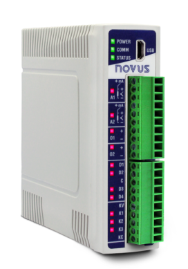
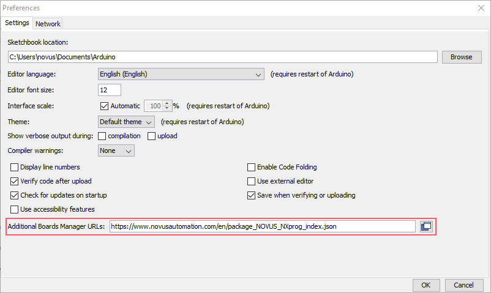
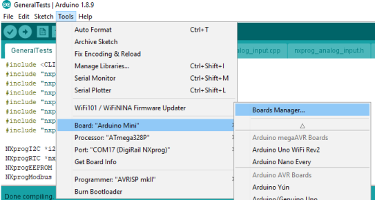
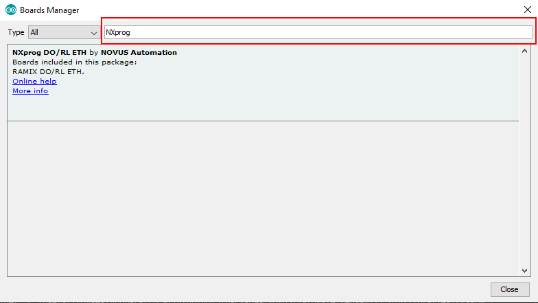

# DigiRail NXprog

## This repository
This repository contains support files to use NOVUS DigiRail NXprog devices such as **NXprog RAMIX 2EA / 2SA / 4ED / 3SD ETH** and **NXprog RAMIX 2EA / 2SA / 4ED / 2RL ETH** with the Arduino IDE.

DigiRail NXprog is an Arduino-compatible device that allows the use of high-level C/C++ programming language, which enables to implement complex algorithms, like recursion logic, state machines, statistical analysis, and mathematic equations. Therefore, this is a big advantage against the complex and old-style of the IEC mid-level programming found in most worldwide PLCs.

   

The user guide is a short version in English, which only shows the functions that can be used and a summary on how to use DigiRail NXprog.

## Installation

### Driver Installation

#### Windows

1. The NOVUS NXprog requires **NXperience** version ***2.0.6.00*** or above.
1. Download the latestes version of **NXperience** from [NOVUS download page](https://www.novusautomation.com/site/default.asp?TroncoID=926290&SecaoID=819426&SubsecaoID=0&Idioma=1) and install it.
1. Plugin the NXprog.
1. Windows will detect the board. 

#### Linux

1. No driver installation is needed.

### Installing NOVUS NXprog Core support in Arduino IDE 

1. The NOVUS NXprog Core requires Arduino IDE 1.8.6 or above.
1. If not installed, download [Arduino Desktop IDE](https://www.arduino.cc/en/Main/Software)
1. Follow the download and installation guidelines as described in [Install the Arduino Desktop IDE](https://www.arduino.cc/en/Guide/HomePage) 
1. After installation, click File->Preferences in the Arduino IDE. A window will appear like the one shown below:

 

1. Click the button next to Additional Boards Manager URLs.
1. Add the reference to NOVUS platform definition
   > https://www.novusautomation.com/en/package_NOVUS_NXprog_index.json
1. Save preferences, then open the Boards Manager.

 

1. Search for 'NXprog' in Boards Manager

 

1. Install the NXprog package.
1. Close Boards Manager, then click Tools->Board and select your NXproduct under 'NXprog Arduino Boards".
1. Plugin the NXprog.
1. Click Tools->Port and choose the COM port. 
1. You can now upload your sketch.

## Language reference
The NXprog Arduino programming language is an extension of the standard [Arduino Language](https://www.arduino.cc/reference/en/) and it was designed to be highly compatible with existing Arduino code.

### Arduino Standard Functions
Although most standard functions have the same functionality, there are small differences as listed in the following items.

***Digital I/O functions***
  * [digitalRead()](./pages/DigitalIO.md#digitalread)
  * [digitalWrite()](./pages/DigitalIO.md#digitalwrite)
  * [pinMode()](./pages/DigitalIO.md#pinmode)
  * [turnOffPWM()](./pages/DigitalIO.md#turnoffpwm)

(see complete document at [Standard Digital I/O](./pages/DigitalIO.md))

***Analog I/O functions***
  * [analogRead()](./pages/AnalogIO.md#analogread)
  * [analogWrite()](./pages/AnalogIO.md#analogwrite)
  * [analogReference()](./pages/AnalogIO.md#analogreference)

(see complete document at [Standard Analog I/O](./pages/AnalogIO.md))

***Advanced I/O***
  * [tone()](./pages/AdvancedIO.md#tone)
  * [noTone()](./pages/AdvancedIO.md#notone)

(see complete document at [Advanced I/O](./pages/AdvancedIO.md))

For all other functions, please refer to [Arduino functions reference](https://www.arduino.cc/reference/en/#functions).

### NXprog Extended Functions
The NXprog extensions to Arduino standard language provide the required functionality to support underlying hardware.

**Novus Expert Analog Input**
  * [setMode()](./pages/ExpertAnalogInput.md#setmode)
  * [setModeLinear()](./pages/ExpertAnalogInput.md#setmodelinear)
  * [setUnit()](./pages/ExpertAnalogInput.md#setunit)
  * [enFilter()](./pages/ExpertAnalogInput.md#enfilter)
  * [setSamplingRate()](./pages/ExpertAnalogInput.md#setsamplingrate)
  * [setState()](./pages/ExpertAnalogInput.md#setstate)
  * [setSafeValue()](./pages/ExpertAnalogInput.md#setsafevalue)

**Novus Expert Analog Output**
  * [setMode()](./pages/ExpertAnalogOutput.md#setmode)
  * [setState()](./pages/ExpertAnalogOutput.md#setstate)
  * [setPowerOnValue()](./pages/ExpertAnalogOutput.md#setpoweronvalue)
  * [setPowerOnState()](./pages/ExpertAnalogOutput.md#setpowerOnstate)
  * [setSafeValue()](./pages/ExpertAnalogOutput.md#setsafevalue)

**Novus Expert Digital Input**
  * [setMode()](./pages/ExpertDigitalInput.md#setmode)
  * [setFunctionMode()](./pages/ExpertDigitalInput.md#setfunctionmode)
  * [setState()](./pages/ExpertDigitalInput.md#setstate)
  * [setConnectionType()](./pages/ExpertDigitalInput.md#setconnectiontype)
  * [setDebounce()](./pages/ExpertDigitalInput.md#setdebounce)
  * [readCounter()](./pages/ExpertDigitalInput.md#readcounter)
  * [readTimer()](./pages/ExpertDigitalInput.md#readtimer)
  * [setPreset()](./pages/ExpertDigitalInput.md#setPreset)
  * [applyPreset()](./pages/ExpertDigitalInput.md#applyPreset)
  
**Novus Expert Digital Output**
  * [setMode()](./pages/ExpertDigitalOutput.md#dsetmode)
  * [setState()](./pages/ExpertDigitalOutput.md#setstate)
  * [setSafeState()](./pages/ExpertDigitalOutput.md#setsafestate)
  * [setPowerOnState()](./pages/ExpertDigitalOutput.md#setpoweronstate)
  * [setActuationMode()](./pages/ExpertDigitalOutput.md#setActuationMode)
  * [enInstant()](./pages/ExpertDigitalOutput.md#eninstant)
  
**Configuration Values**
  * [Analog Configuration](./pages/AnalogConfiguration.md)
  * [Digital Configuration](./pages/DigitalConfiguration.md)
 
**Configuration Functions**
  * [getAInConfig()](./pages/Configuration.md#getainconfig)
  * [getAOutConfig()](./pages/Configuration.md#getaoutconfig)
  * [getDInConfig()](./pages/Configuration.md#getdinconfig)
  * [getDOutConfig()](./pages/Configuration.md#getdoutconfig)
  * [getDigiRailFWVersion()](./pages/Configuration.md#getdigirailfwversion)

**Special Features**
  * [Modbus registers](./pages/SpecialRegisters.md)
  * [Watchdog timer](./pages/WatchdogTimer.md)
  * [Real Time Clock](./pages/RTC.md)  
  * [EEPROM](./pages/EEPROM.md)    